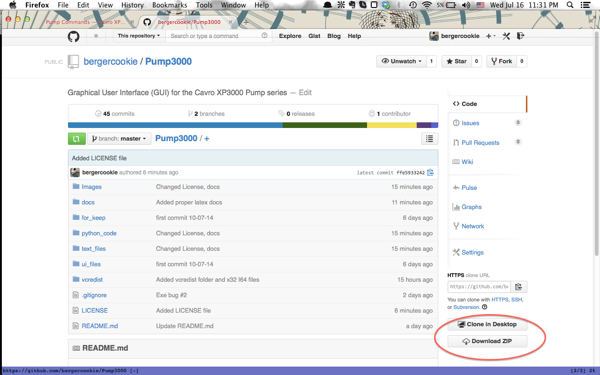

Getting Started
=========================================================

There are 2 ways of running the XP3000 GUI:

- Running the *Pump3000.exe* [Windows only]
- Running *from source* [Python required]

Either way the user must first download the necessary files for the software,
located at http://www.github.com/bergercookie/Pump3000. This can be 
done either by downloading the project locally from the github page or by cloning the project

The user can **download the software** by visiting the github page:
http://www.github.com/bergercookie/Pump3000 and then pressing 
the *Download Zip* button

.. _downloading:

   Downloading the software

In order to **clone** the project the user must first make sure that git is installed 
on the platform. If it isn't then installing it requires issuing::

    sudo apt-get install git "for Linux users - command-line
    sudo port install git "MacOS users - command-line

Then in order to clone the project the user can run the git clone command::
    
    git clone http://wwww.github.com/bergercookie/Cavro-Pump-XP3000-GUI.git 

For windows users, the desktop version of Github is suggested: 
https://help.github.com/articles/set-up-git#platform-windows

