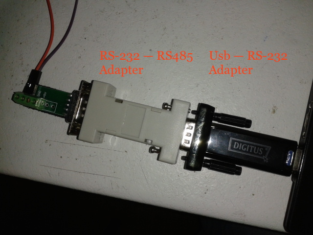

Hardware Configuration
=========================================================

Equipment used
--------------

For the hardware communication to be achieved the following equipment is suggested:
    - USB    ->  Serial (RS-232) adapter
    - RS-232 ->  RS-485 converter
    - Power cables (Power + GND)
    - Jumper wires (at least 2 Female to Male)
    - Breadboard (optional)

Connecting the XP3000
----------------------

The serial communication with the pump was implemented using the RS-485 serial
protocol.

.. _hardware-conf:

.. figure::  ../Images/breadboard.jpg
    :height: 7000px
    :scale:  10 %
    :align:   center

    Suggested Hardware Communication to the pump

.. _adapters:

    Adapters setup

The needed steps to archive a similar connection would be the following:

1. Connect the pump to a power supply. As described in the 
manual the XP3000 requires a **24VDC power supply** with a current rating of at least **1.5A**.
As seen in hardware-conf_, during the development part, the power was supplied indirectly to the pump
first by running the supply cables into a breadboard and then using extra jumpers to 
connect to pump pins #1 (power) and #9(GND)

2. For the serial communication, you need to connect the RS-485A, RS-485B signals from the pump PCB
into the RS-485+, RS-485- of the data terminal (PC) used for the communication.
Take extra notice when it comes to connecting the jumpers from the serial adapter
to the pump PCB corresponding pins

3. Also if the computer in use doesn't have a serial port available, the user should use either
a USB to RS-485 adapter, or combine a more commonly found *USB to RS-232 with a RS-232 to 
RS-485* adapters_

To sum it up, here is the typical RS-485 pinout for the pump [#f1]_, as it is described above

+-------------+--------------+---------------------------------+
|  Role       | Pin No       |  Signal to Connect              |
+=============+==============+=================================+
|             | #1 [Power]   |    24 VDC                       |
+**Power**    +--------------+---------------------------------+
|             | #9 [GND]     |    Ground (of the power supply) |
+-------------+--------------+---------------------------------+
|**Protocol** | #11 [RS-485A]|    RS-485 (+)                   |
+**Signals**  +--------------+---------------------------------+
|             | #12 [RS-385B]|    RS-485 (-)                   |
+-------------+--------------+---------------------------------+

.. rubric:: Footnotes

.. [#f1] For more information regarding the pump pinout consult the pump manual
